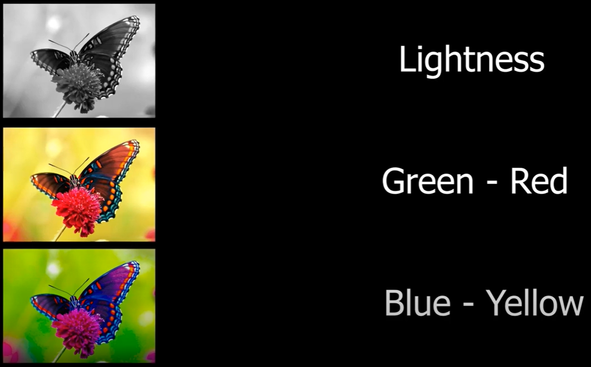
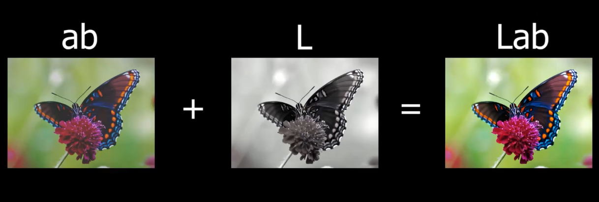

# Colouring_AI

#### RGB -> LAB

Istedet for at kigge på RGB-værdier, så kigger vi på LAB, som er lysets
intensitet (L), farverne grøn og rød (A) og farverne blå og gul (B)
 Herefter bliver "L" brugt som input, som træner modellen i, at
komme frem til de rigtige farver ved "A" og "B". Tilsidst, smider vi "L" oven
på, så lyset også stemmer overens. 
